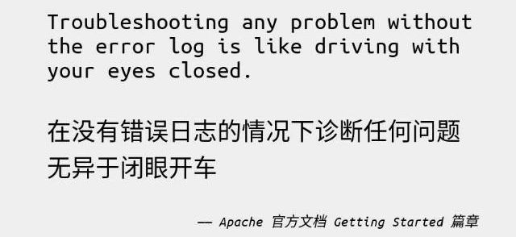
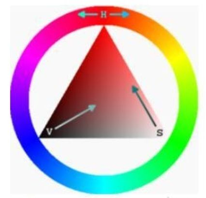
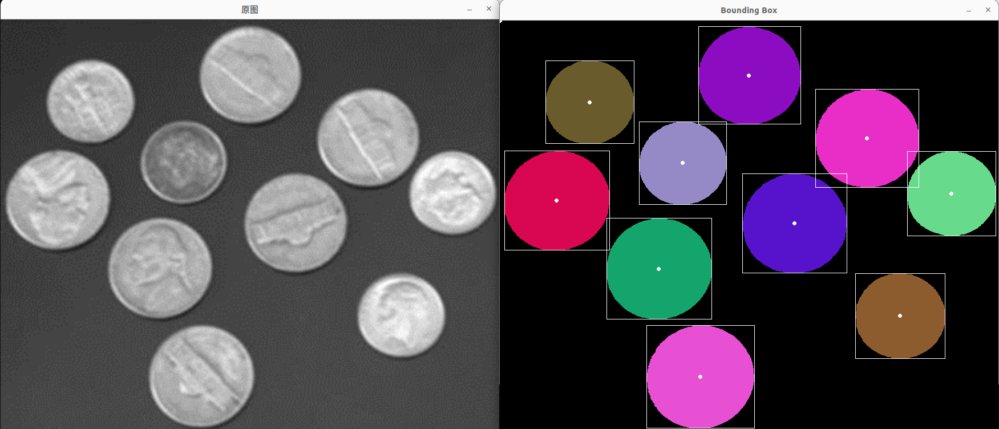
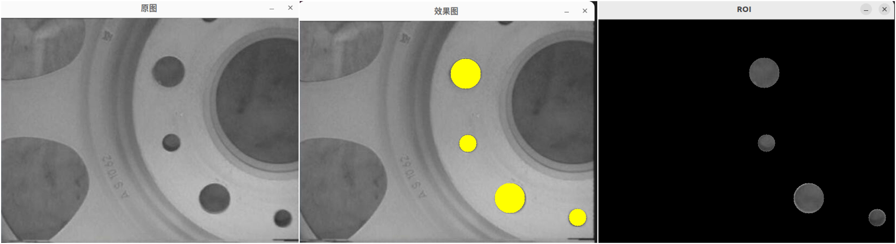
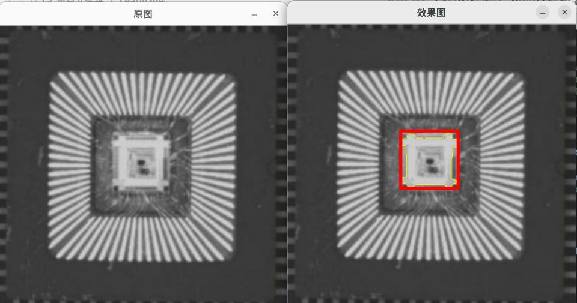
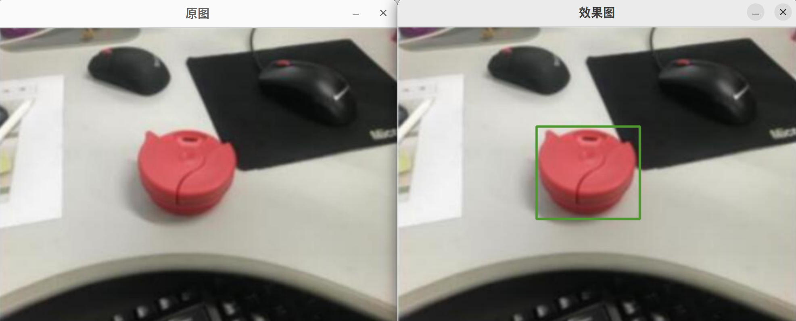
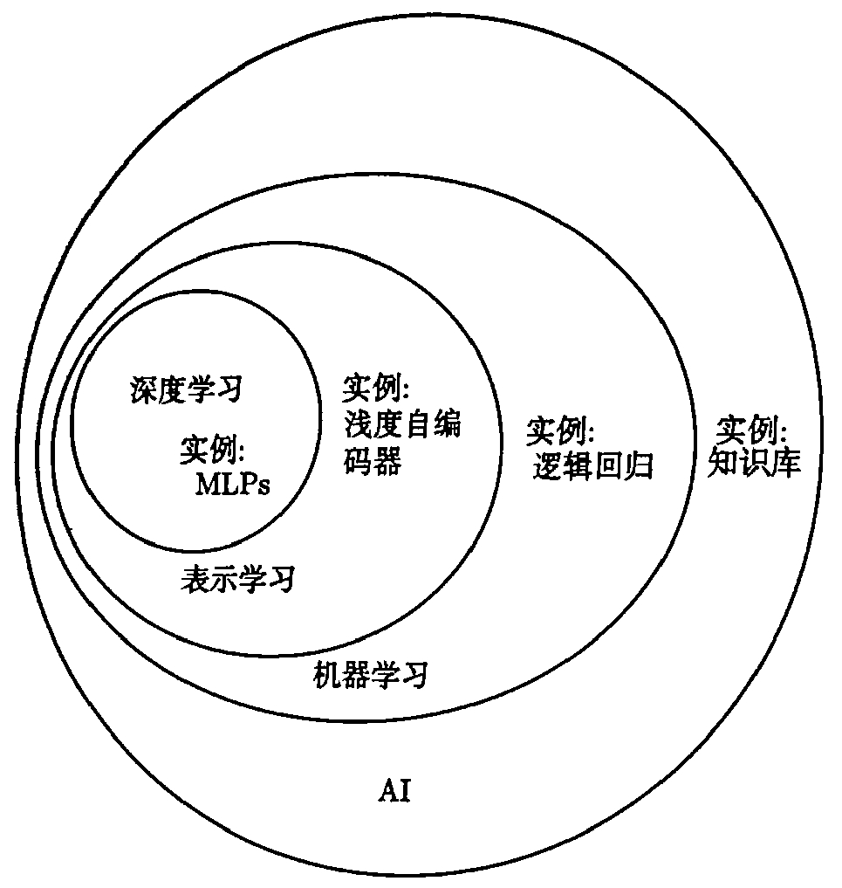
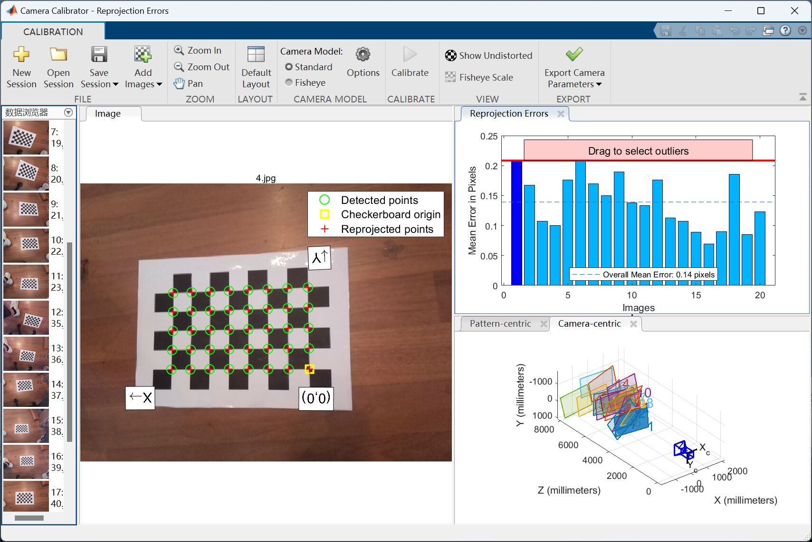

# **2024视觉寒假任务**
Author: zyt
## **前言**
&emsp;&emsp;首先恭喜大家经过两轮筛选，正式成为了航模队的一员，在这里先祝大家寒假快乐！（不过如果后期懈怠了也有被开除的风险哦o(^-^)o）  
&emsp;&emsp;相信经过前期的学习积累，大家已经掌握了一定的基础知识，所以本次任务也主要起到引导作用，希望大家在掌握这些基础知识后，能够运用到实际项目上。  
&emsp;&emsp;下面**强调两点**:
1. **不允许将任务丢给ChatGPT**，最多允许在问题实在看不懂，各种解决方法均无果后让其帮忙解释报错。
2. 有问题最好在群里问，大家互相讨论解决，但**禁止开源**；另外，提问前请务必阅读**提问的智慧**[How To Ask Questions The Smart Way](http://www.catb.org/~esr/faqs/smart-questions.html)
<center class ='img'>

</center>      

## **任务要求**
+ 记录学习笔记
+ 代码+注释
+ 有代码思路
+ 使用各种函数时不同参数的组合
+ 运行效果截图(原图和运行效果比对)
+ 命名清晰有逻辑  
参考文件架构（以OpenCV任务二为例）
```bash
LearnOpenCV
└── averageRGB
    ├── c++
    │   ├── 效果图.png
    │   ├── bulid
    │   ├── CMakeLists.txt
    │   └── main.cpp
    └── python
        ├── 效果图.png
        └── main.py
```
+ 在**github**上新建仓库按以上要求上传所有寒假作业，**每完成一个小任务就及时上传**
## **任务内容**
### **一、OpenCV** (分别使用**c++语言**和python语言实现)
1. 下载一张图片，使用imread读取，然后用imshow显示图片，了解如何改变输出图像的大小，并让图像分别完整显示在显示器的四个角。
2. 了解OpenCV处理单个像素和通道的方法，将一张彩色图片每个像素的RGB值改为三通道均值average。
3. 了解threshold函数原理，并手动实现，即在任务二的基础上，在最前面声明一个变量，遍历每一个像素，当average值大于变量值时设为255，反之为0，观察不同变量值处理结果。
4. 了解深拷贝与浅拷贝的区别，分别对同一图像进行深浅拷贝，并对拷贝后的图像进行任务三的处理，观察两者有什么区别。
5. 了解通道分离，将同一张彩色图片的三个通道分别分离。
6. 了解Gamma矫正原理（为什么、怎么做），并手动实现，使用图片见图6-1、6-2。
7. 了解HSV意义，将图片转化到HSV色域，并用inRange分别提取一张复杂彩色图片中红色和蓝色像素的部分，并思考在不同光线下参数应该怎么改。
<center class ='img'>

</center>

8. 学习OpenCV中基本的绘图功能，实现：画点、画线、画圆、画矩形。
9. 了解腐蚀、膨胀、开运算和闭运算，使用不同形状大小的算子，使用图片见图9。
10. 了解canny算子原理（以及其进一步改进方法），并手动实现。
11. 对图11进行合适的预处理，然后进行连通域标记（connectedComponentsWithStats函数），并绘制出每一个硬币的重心，并将硬币个数输出到终端
<center class ='img'>

</center>

12. 对图12进行回形针计数，并标出每个回形针的轮廓和凸包，并比较这两者有什么不同，思考凸包可以用在什么场景。
13. 使用OpenCV分别调用电脑摄像头和手机摄像头（判断是否打开摄像头、判断是否成功读取图像），测算两者的帧率，并对图像进行中值滤波、均值滤波和高斯滤波。
14. 运用所学知识，为图14-1、14-2的人进行美容处理（去痘、去皱纹）。
15. 学习滑动条函数createTrackbar，使用滑动条来调参，从而确定合适的参数（可以以调节二值化参数为例）。
16. 学习鼠标回调函数SetMouseCallback，使鼠标点击图片时，能在终端输出鼠标点击位置坐标和当前像素点的颜色。
17. 综合考察：对图综合考察1、2、3进行处理，将ROI区域单独显示出来，实现下面效果：
<center class ='img'>

</center>
<center class ='img'>

</center>
<center class ='img'>

</center>

### **二、深度学习**（推荐使用pytorch框架）
1. 简单概念理解（为什么、什么用、怎么做）：
+ 梯度下降、反向传播算法、梯度消失、梯度爆炸
+ 卷积神经网络（全连接层、卷积层、池化层、激活函数、损失函数）
+ **评价指标**（准确率、召回率、F1分数、混淆矩阵、置信度）
+ 优化算法（学习率调整、梯度估计修正）
+ 数据预处理、归一化
+ 网络正则化（权重衰减、提前停止、丢弃法、数据增强）
+ 迁移学习
<center class ='img'>

</center>

2. 卷积神经网络MNIST手写数字识别
+ 自行设计神经网络结构（可以跟着教程敲，但要理解）
+ 理解batch_size、损失函数、优化器等概念，至少选择三种不同参数组合并比对训练结果，将训练结果制成对比表格
+ 最终在测试集上正确率需达到95%
3. yolo目标检测模型
+ 尝试了解其原理
+ 跑通源码，分析训练结果，调整参数并将调参前后训练结果制成对比表格
+ 将训练好的pt权重文件导出成onnx并使用OpenCV的dnn模块在c++里进行部署，思考为什么要部署到c++上
+ 分别输出在python中检测和在c++中检测所用时间（至少比对两个不同模型）
4. 综合考察-汽水分类
+ 自行拍摄、标注数据集
+ 至少能分类三种汽水
+ 最后能通过手机摄像头传输视频流并在电脑上实时显示检测结果和当前帧率
### **三、SLAM**
1. 了解像素坐标系、相机坐标系、世界坐标系之间的转换关系
2. 了解**相机标定**，学习至少一种相机标定方法，并使用matlab或opencv标定一个相机
<center class ='img'>

</center>

### **四、综合考察**（以检测对地靶标为例）
+ 提供数据图片15张（7张模型比例靶标+7张真实比例靶标+1张官方模版）
+ 综合运用上面所学知识，选用传统视觉（OpenCV）或深度视觉（目标检测模型，不一定用yolo）进行五边形靶标检测 (传统视觉需完整实现，深度视觉由于缺乏数据集只需叙述具体实现流程)
+ 最终实现效果为将靶标正面朝上（即数字正对，不要求数字具体检测算法），并将靶标的外接矩形以一个新的窗口显示出来
+ 将最终成果整理成一份**word报告**，要求至少有以下内容：    
    1. 至少两种尝试过的靶标检测方法，遇到的问题等，传统视觉每种方法需要三张效果图
    2. 考虑以下问题：
        + 如何判断靶标正向？
        + 算法是否能适应不同光线条件？
        + 如何检测真实情况下的小比例靶标？

## **相关资料推荐**
+ 《**OpenCV3编程入门**》毛星云 （虽然现在已经用OpenCV4了，但本书仍有很大的学习价值）[浅墨_毛星云的博客-CSDN博客](https://blog.csdn.net/zhmxy555/category_1923021.html)
+ 《**视觉SLAM十四讲**》高翔 （第五讲比较重要）[视频教程](https://www.bilibili.com/video/BV16t411g7FR/)
+ [《神经网络与深度学习》](https://nndl.github.io/)邱锡鹏 （偏理论）
+ 《深度学习》（**花书**）
+ [《动手学深度学习》](https://zh.d2l.ai/)
+ [[双语字幕]吴恩达深度学习deeplearning.ai_哔哩哔哩_bilibili](https://www.bilibili.com/video/BV1FT4y1E74V/)